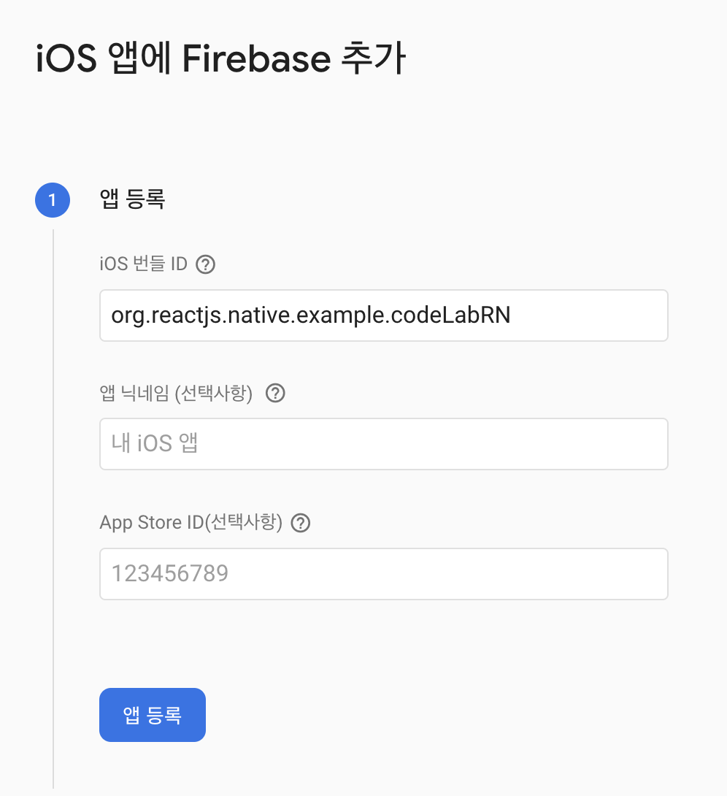
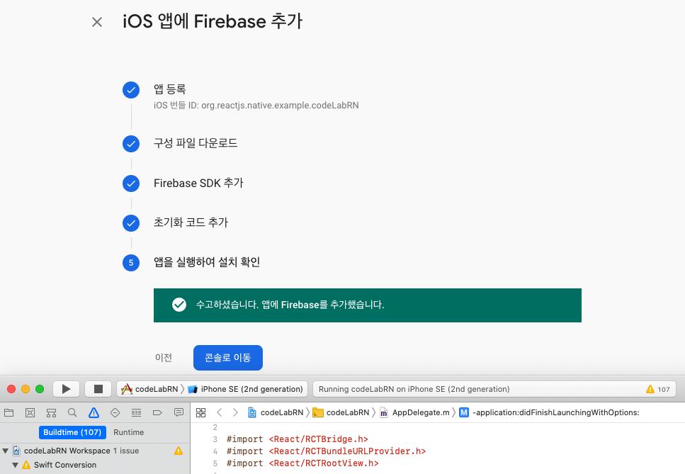
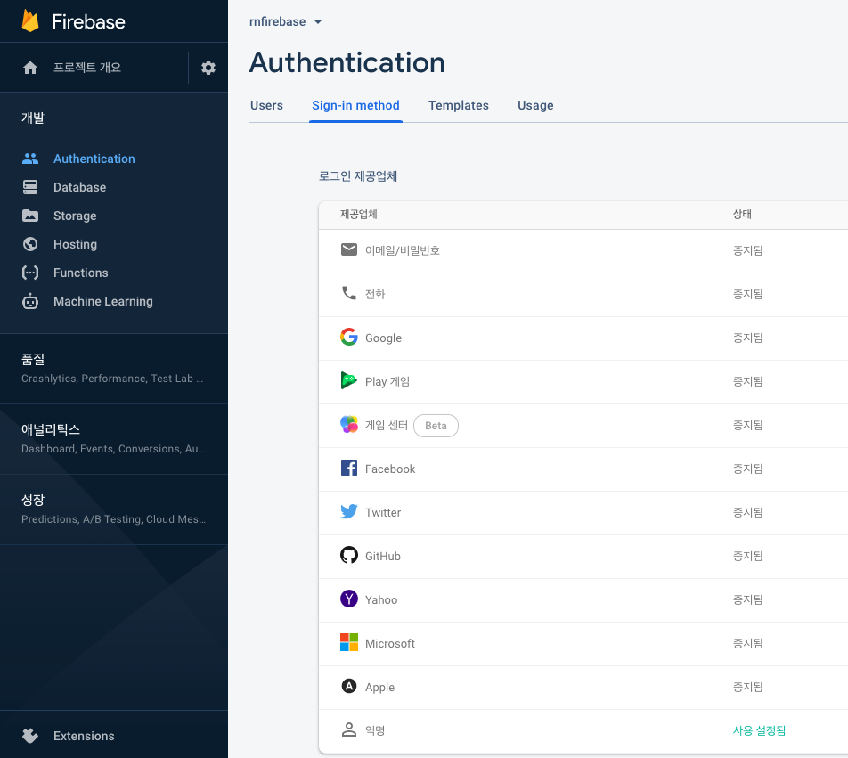
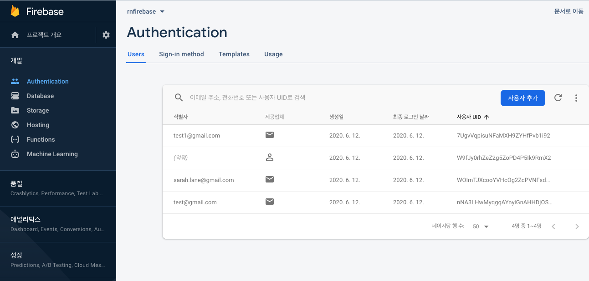
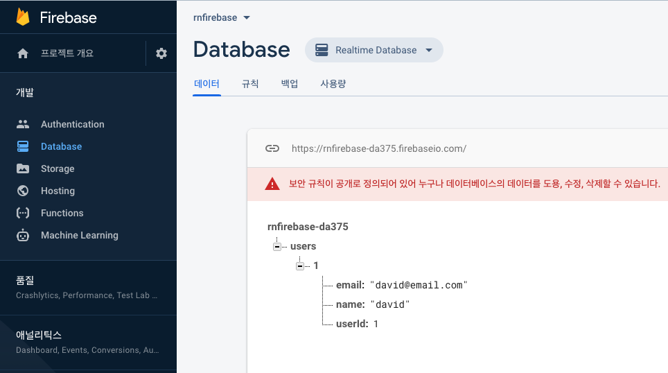

## REACT NATIVE FIREBASE
- react-native-firebase의 모듈 설치시 항상 ios 폴더가서 ```pod update``` 실행

### 설치 및 xcode 연동
- npm install --save @react-native-firebase/app
- cd ios & pod install
- open codeLabRN.xcworkspace
  - 현재 프로젝트 xcode가 바로 열림
  - Bundle Identifier 확인 가능


- 파이어베이스 로그인 후 iOS 앱에 Firebase 추가
  - Bundle Identifier 입력


- 구성파일 다운로드 & ios 프로젝트 루트폴더에 추가


- Podfile열고 target 'codeLabRN' do의 end끝나기 전에 아래 문구 추가
  - ```pod 'Firebase/Analytics'``
  - pod update 실행

- AppDelegate.m 파일 수정


- 앱 실행해서 설치 확인
  - import firebase from '@react-native-firebase/app';
  - Xcode에서 ▶ 눌러서 시뮬레이터로 실행해보기



### 로그인
- 익명 로그인
  - https://rnfirebase.io/auth/usage


```javascript
import auth from '@react-native-firebase/auth';

class RnFirebase extends Component {
  componentDidMount() {
    auth().signInAnonymously()
    .then( authInfo => {
      console.log('authInfo', authInfo);
    })
    .catch(error => {
      if (error.code === 'auth/operation-not-allowed') {
        console.log('Enable anonymous in your firebase console.');
      }
      
      console.error(error);
    });
  }
}
```

- 이메일 로그인
  - https://rnfirebase.io/auth/usage
  - firebase console -> Authentication -> 이메일/비밀번호

```javascript
import auth from '@react-native-firebase/auth';

class RnFirebase extends Component {
  componentDidMount() {
    // 이메일로 가입시키고 로그인
    auth()
    .createUserWithEmailAndPassword('<test1></test1>@gmail.com', 'SuperSecretPassword!')
    .then( authInfo => {
      console.log('authInfo', authInfo);
    })
    .catch(error => {
      if (error.code === 'auth/email-already-in-use') {
        console.log('That email address is already in use!');
      }
      if (error.code === 'auth/invalid-email') {
        console.log('That email address is invalid!');
      }
      console.error(error);
    });
  }
}  
```

- 콘솔 Authentication 에서 사용자 확인
  - Users탭에서 비밀번호 재설정 가능(이메일로 변경 링크보냄)
  - Templates탭에서 비밀번호 재설정 이메일 양식도 수정 가능



### 데이터베이스
- npm i @react-native-firebase/database
- https://rnfirebase.io/database/usage

#### insert
```javascript
import database from '@react-native-firebase/database';

class RnFirebase extends Component {
  componentDidMount() {
    database()
    .ref('/users/1') // insert할 객체(Document)
    .set({ // insert할 데이터
      userId: 1,
      name: 'david',
      email: "david@email.com"
    })
    .then(() => console.log('Data set.'));
  }
}
```

- 결과


#### select
```javascript
import database from '@react-native-firebase/database';

class RnFirebase extends Component {
  componentDidMount() {
    // 데이터 베이스 생성
    database()
    .ref('users') // select할 객체
    .once('value') // 실시간이 아닌 한번만 수행
    .then(snapshot => {
      console.log('User data: ', snapshot.val()); // 데이터 값만 가져옴
    });
  }
}
```

```javascript
```

## 참고 동영상
- 파이어베이스 가입 및 연동
  - https://youtu.be/zYojRZ9Wn50
- 파이어베이스 사용법
  - https://youtu.be/jO5EPmzUf28
