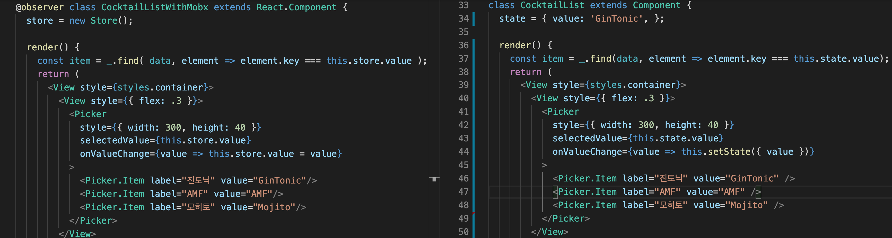

## Mobx
- 반응형 프로그래밍 Reactivity Programming의 일종
- 가장 간단하고 단순한 형태로 데이터의 상태 state를 observable과 observer 형태로 관리
- mobx 단독으로도 사용할 수 있고 리액트를 위한 mobx-react를 사용하면 더욱 편리



## 설치
- npm i mobx mobx-react
- npm i @babel/plugin-proposal-class-properties @babel/plugin-proposal-decorators
- decorators 경고 없애기 위한 jsonfig 생성
```json
{
  "compilerOptions": {
      "experimentalDecorators": true,
  }
}
```

## decorator
-	@observable : 변경되면 화면을 렌더링 하는 state 역할의 값,
-	@computed : 캐싱해서 보유하는 값
- @observer : observable값을 사용 가능한 클래스
- observer는 observable값을 감시하다가 변하면 재렌더링을 하기 때문에 불변성을 지킬 필요가 없다/

```javascript
class Data {
	@observable text = '';
	@observable list = [];
}

@observer class App extends React.Component {
	data = new Data(); // 클래스 내부에서 Data속의 text와 list를 사용 가능

	addItem = () => {
		if( this.data.text === '' ) return false;
		this.data.list.push( {
			key: uuid(),
			text: this.data.text,	
		} );
		const json = JSON.stringify( this.data.list );
		AsyncStorage.setItem( 'todoList', json );
		this.data.text = '';
	};
}
```

```javascript
```

```javascript
```

```javascript
```

```javascript
```


